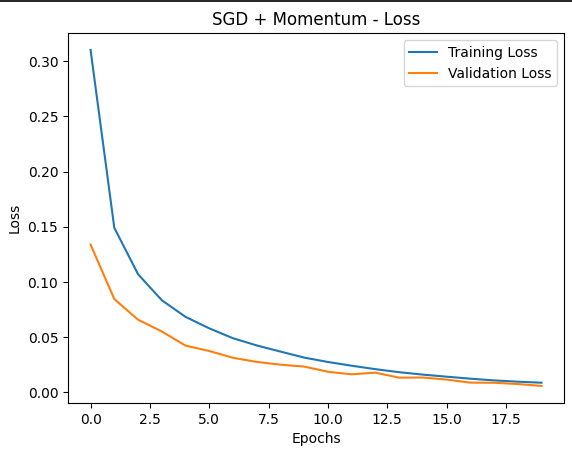
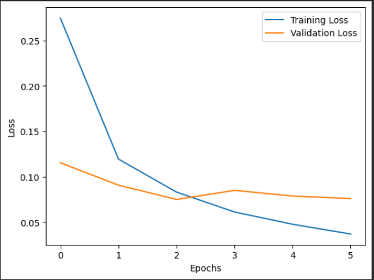
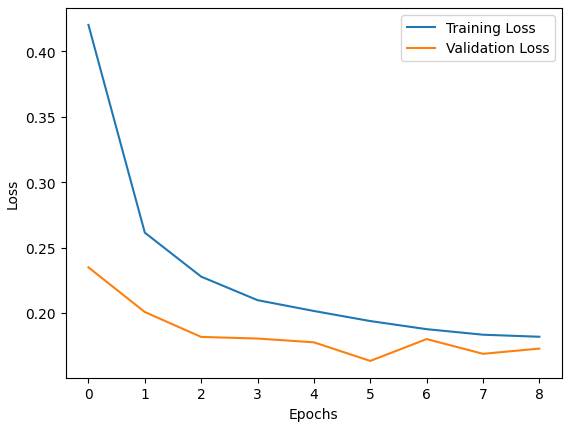
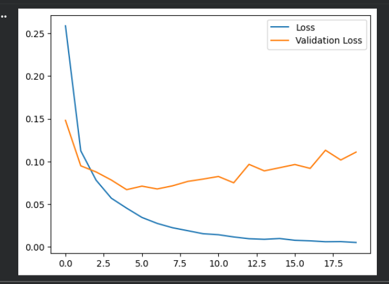
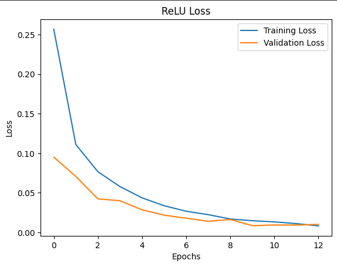
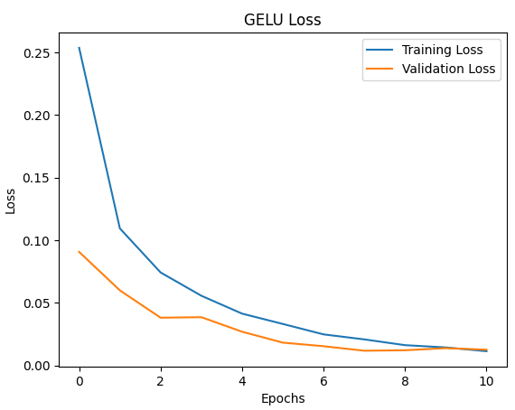
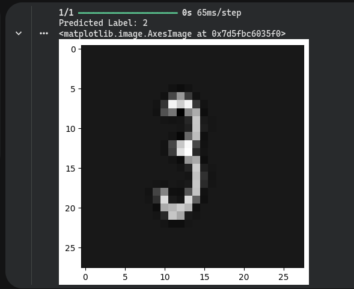

# Deep Learning Foundations Experiments

## Project Overview
This project presents a series of structured experiments to study fundamental concepts in deep learning.
The goal is to analyze how optimization methods, regularization techniques, activation functions,
batch size, and model capacity affect training dynamics and model generalization.

All experiments are conducted using the same neural network architecture to ensure fair comparison.

---

## Notebook Sections Overview

The notebook is organized into **three main parts**:

### Part 1 — Neural Networks & Optimization
- Training dynamics and convergence behavior
- Optimizer comparison:
  - SGD
  - SGD with Momentum
  - Adam
  - AdamW
- Analysis of convergence speed and stability

### Part 2 — Regularization & Generalization
- Overfitting analysis across epochs
- Dropout ablation study
- L2 regularization experiments
- EarlyStopping behavior
- Batch size and gradient noise analysis

### Part 3 — Model Capacity & Activation Analysis
- Activation function comparison:
  - ReLU
  - Tanh
  - Softsign
  - GELU
- Gradient flow and vanishing gradients
- Weight inspection and model capacity analysis

---

## How to Run the Notebook

1. Clone the repository:
   ```bash
   git clone https://github.com/aya2500/DEPI_AI_Journey
   cd DL/FoundationsofDeepLearningTask
   the notbook named Neural_Network_Task
   
2.Install dependencies:

- pip install tensorflow numpy matplotlib


3.Run the notebook:

- jupyter notebook "Neural_Network_Task"


4.Execute all cells sequentially to reproduce the results.

## Sample Results
### Optimizer Comparison

Adam shows fast and stable convergence compared to classical optimizers.




### Regularization Effects

Regularization techniques reduce overfitting by controlling model complexity.




### Overfitting Across Epochs

Training and validation loss divergence highlights the onset of overfitting.



### Activation Function Analysis

Different activation functions affect gradient flow and convergence speed.




### Generalization Test

The model successfully generalizes to unseen handwritten digit samples.




Key Observations

Adaptive optimizers (Adam, AdamW) converge faster than classical SGD.

Dropout and L2 regularization reduce overfitting through different mechanisms.

Overfitting becomes visible when training loss decreases while validation loss increases.

ReLU and GELU provide better gradient flow compared to saturating activations.

High model capacity improves learning power but increases overfitting risk without regularization.

